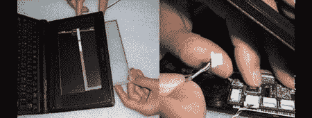

# 用于 Eee PC 的触摸屏套件

> 原文：<https://hackaday.com/2008/06/01/touchscreen-kit-for-eee-pc/>

在之前，我们已经为 Eee PC 701 精选了 [hacks，但是没有什么比](http://www.hackaday.com/2008/01/19/add-everything-to-your-eeepc/)[这个触摸屏套件](http://jkkmobile.blogspot.com/2008/06/easy-to-add-touch-screen-kit-for-asus.html)更简单的了。

这个套件包括所有需要的东西:触摸板、USB 控制卡和正确的连接器。触摸面板位于屏幕前方的框架内。控制器插在 USB 网络摄像头上。这个 mod 可以通过 9 个步骤完成安装，其中最难的是移除几个螺丝。对于第一次修改的人来说，这是一个很好的解决方案，但是如果你不害怕一点焊接并且喜欢更多的挑战，看看 jkkmobile 的原创[触摸屏黑客](http://jkkmobile.blogspot.com/2007/12/asus-eee-pc-with-touch-screen.html)。他甚至暗示，他已经成功地为他的 Eee 900 增加了触感。

*   [永久链接](http://jkkmobile.blogspot.com/2008/06/easy-to-add-touch-screen-kit-for-asus.html)