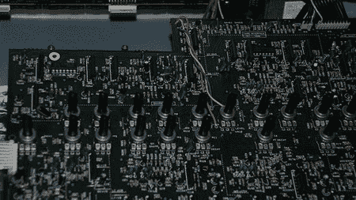
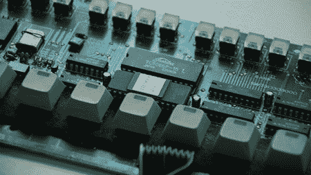

# TR-909 提尔城

> 原文：<https://hackaday.com/2008/06/18/tr-909-teardown/>

Flickr 用户[firegroove]最近不得不拆开他的 Roland TR-909 鼓机进行修理，他拍摄了整个拆卸过程，并向[提供了 TR-909 内部零件的详细图片](http://www.flickr.com/photos/27688089@N03/sets/72157605658313676/)。TR-909 是第一个可以存储整首歌曲的完全可编程鼓机，这是一个传奇，它的传奇只是因为它的稀缺而增加:只生产了 10，000 台。如果你负担不起或者只是拒绝把你的照片拆开，那就在拆开后多找几张里面的照片。

这是 TR-909 中最大 PCB 的一个镜头，其中包含所有控制台旋钮。

在这个装有 16 步按钮的电路板的特写中，你可以清楚地看到中间的 TC5565P-15 芯片，这是一个通用的内存芯片。它可能是整机中最容易更换的部件之一。还可以看到 TR-909 专用的其他一些芯片。

我们希望看到更多关于每个部分的描述。也就是说，很高兴看到这台机器的内部，考虑到它的稀有性和一般所有者对它的重视，这可能是一个很高的要求。如果你有兴趣感受 TR-909 的声音，请查看[重生 RB-338](http://www.rebirthmuseum.com/) :这是一个退休的程序，模拟模拟硬件来模拟 TR-909 的功能和声音，以及它的姐妹鼓机器 TR-808 和杰出的 TB-303。

【通过【T0 矩阵合成】

*   [永久链接](http://www.flickr.com/photos/27688089@N03/sets/72157605658313676/)