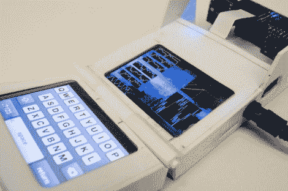

# 三录仪项目使传说中的设备成为现实

> 原文：<https://hackaday.com/2012/03/29/tricoder-project-brings-the-fabled-devices-into-existence/>

不管你是否喜欢《星际迷航》,我们打赌你知道什么是三录机。这种手持设备能够收集你周围环境的信息，或者对受伤的船员进行健康诊断，当第一次在原版电视剧中看到时，这似乎是一种不可思议的先进技术。但是我们技术进步如此之快，以至于你现在可以自己制作一台三录仪。这正是[彼得·詹森]所做的。他创立了三录仪项目，作为将一种有用的科学仪器交到好奇的大众手中的一种方式。

在插播的宣传片中，詹森博士向我们回顾了他目前的进展。这个项目已经制作了三个版本，第四个正在制作中。第一次迭代可以获取大气、空间和磁场读数。这包括温度、湿度、GPS 数据、光强度和距离测量等。它被装在一个深灰色的盒子里，看起来很像原来的道具。

上面看到的第二个模型实现了一个可交换的传感器板。这是悬挂在顶部的部分，但成品模型将封装外壳的这一部分。它的硬件非常棒，使用运行 Linux 的 ARM 处理器和两个 2.8 英寸有机发光二极管触摸屏。但这两种型号的价格都太高，无法广泛使用。他一直在研究另外两个，马克 3 和马克 4。最近的一次是在软件开发阶段，希望当所有的细节都制定出来后可以进行大规模生产。

这个项目的网站上有很多信息需要挖掘。它是开源的，我们通常寻找的所有好东西都在那里。

[https://www.youtube.com/embed/y3sHTKrGdKI?version=3&rel=1&showsearch=0&showinfo=1&iv_load_policy=1&fs=1&hl=en-US&autohide=2&wmode=transparent](https://www.youtube.com/embed/y3sHTKrGdKI?version=3&rel=1&showsearch=0&showinfo=1&iv_load_policy=1&fs=1&hl=en-US&autohide=2&wmode=transparent)

[感谢每一个提供相关建议的人]