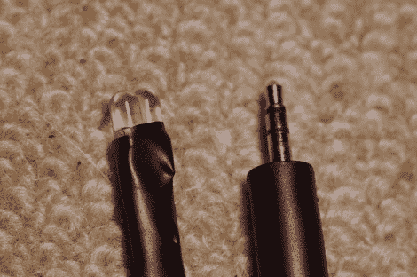

# 用音频剪辑触发 DSLR 快门

> 原文：<https://hackaday.com/2011/02/03/triggering-a-dslr-shutter-with-an-audio-clip/>

显然宾得 DSLR 相机有一个使用红外信号的遥控快门选项。[Pies for you]收集了几种不同的黑客技术，构建了一种使用自定义音频触发相机的方法[。他组装了上面的加密狗，只是一根耳机延长线和两个红外 led，可以插入任何音频设备的耳机插孔，如 iPod 或 Android 手机。播放文件时，音频信号驱动红外 led。除非您使用正确的频率、占空比和位编码制作自己的音频文件，否则这是完全没有价值的。[给你的馅饼]就是这么做的，让事情开始运转。看起来系统在 MP3 压缩方面做得不太好，但是看看他发布的波形分析，然后确保你使用的是无损格式。](http://www.pentaxforums.com/forums/pentax-dslr-discussion/131633-absurdly-simple-diy-k-x-remote-timer-using-mp3-player.html)