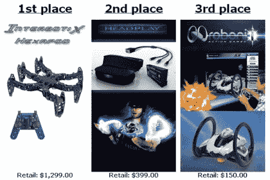

# 特罗森机器人公司举办另一场比赛

> 原文：<https://hackaday.com/2010/09/02/trossen-robotics-holding-another-contest/>

你必须在 12 月 1 日前报名参加 [Trossen DIY 机器人竞赛](http://www.trossenrobotics.com/contest.aspx)。不像上次我们告诉你的的[特罗森竞赛，这次没有明确的主题。目标很简单，就是制造一个令人敬畏的机器人。注册是免费的，参赛作品将根据独创性、原创性和陈述/文件进行评判。第一名、第二名和第三名都有奖品，第一名奖品是 Interbotix Hexapod。如果你还没看过，这是一个六足动物的套件，它的脚非常快。休息之后你可以看一段视频。](http://hackaday.com/2008/09/18/crabfu-challenge-winners-announced/)

[https://www.youtube.com/embed/stfwAdV0Vmc?version=3&rel=1&showsearch=0&showinfo=1&iv_load_policy=1&fs=1&hl=en-US&autohide=2&wmode=transparent](https://www.youtube.com/embed/stfwAdV0Vmc?version=3&rel=1&showsearch=0&showinfo=1&iv_load_policy=1&fs=1&hl=en-US&autohide=2&wmode=transparent)

【通[骨瘤](http://www.botjunkie.com/2010/08/31/trossen-robotics-puts-up-major-swag-for-diy-contest/)