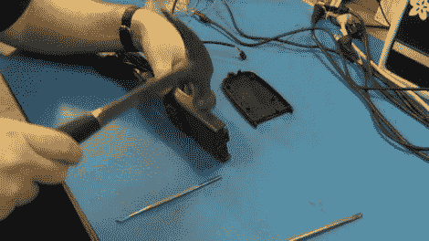

# 家用照明定时器故障排除

> 原文：<https://hackaday.com/2011/12/13/troubleshooting-household-light-timers/>

当[托德·哈里森的]圣诞灯一直亮着，超过了预先设定的关闭时间，他知道计时器出了问题。他把设备带到自己的车间，花了一些时间对设备进行诊断和维修，他把这个过程录了下来，让大家看。

用锤子砸开无螺丝计时器后，他检查了印刷电路板是否有任何明显的损坏迹象。在看到一个看起来像损坏的晶体管后，他把它从电路板上拆下来进行测试。在晶体管成功通过测试后，[托德]认为故障一定出在晶体管负责开关的继电器上。

果不其然，继电器短路了，当他把它切开时，他发现触点熔在一起了。他分离并打磨掉了隐形眼镜，使他能够让计时器工作——至少目前是这样。

[Todd]制作这个视频的部分目的是展示不同的脱焊方法，包括手动焊钳(我最喜欢的)、脱焊编织物和特制的脱焊铁。如果你想买一些拆焊工具，但不知道该买什么，[托德]很乐意提供他的建议。

继续阅读，观看[Todd]故障排除过程的视频。

[https://www.youtube.com/embed/VUAu_zXsudM?version=3&rel=1&showsearch=0&showinfo=1&iv_load_policy=1&fs=1&hl=en-US&autohide=2&wmode=transparent](https://www.youtube.com/embed/VUAu_zXsudM?version=3&rel=1&showsearch=0&showinfo=1&iv_load_policy=1&fs=1&hl=en-US&autohide=2&wmode=transparent)