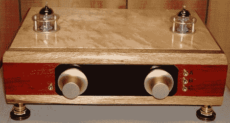

# 带有炫目木质外壳的电子管前置放大器

> 原文：<https://hackaday.com/2010/08/28/tube-preamp-with-a-dazzling-wood-case/>

It’s been a while since we’ve looked in on the world of vacuum tube audio equipment. [Bruce] just finished documenting [a tube preamp he built](http://diyaudioprojects.com/Tubes/ECC802S-ECC82-12AU7-Tube-SRPP-Preamp/). He actually made a couple of these with slightly different cases but they use the same circuit design. We found his discussion of common errors made when tying into ground quite interesting. It seems that many folks struggle with noise in their circuits because of ground loops. There’s some details about isolating the signal ground from a metal chassis, and also an admonition about not connecting the input or output jacks directly the chassis.If you like this, don’t miss on of our favorite tube projects, [[Bruce’s] Poddwatt](http://hackaday.com/2009/10/23/poddwatt-tube-amp-with-mp3-in-mind/).