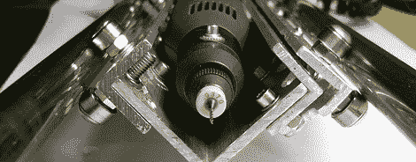

# 将旋转工具变成 PCB 钻床

> 原文：<https://hackaday.com/2012/03/26/turning-a-rotary-tool-into-a-pcb-drill-press/>

在 PCB 上钻孔几乎总是一种妥协；孔很小，精度是最重要的，普通的解决方案，如 Dremel 钻床，不是最高质量的。为了寻找在印刷电路板上钻孔的最佳方式，[reboots]甚至找到了一个气动牙钻，但只有高质量的微型钻床才能做到。不想花数百美元钻几个洞，[重新启动]做了明智的事情，[从头开始做了一个](http://reboots.g-cipher.net/pcbdrill/)。

[reboots]在阅读了互联网上一致好评后，最终买了一台[prox on Micromot 50](http://www.proxxon.com/eng/html/28500.php)。不过，要将这种旋转工具用作钻床需要更多的工作。从点阵打印机中回收两根精密钢棒，并用螺栓将铝制 C 形槽和小型轴承固定在一台非常高精度的钻床上。只用手工工具建造了这台钻床，而[的成果是惊人的](http://reboots.g-cipher.net/pcbdrill/image/pmtjigs.jpg)。

[reboots]最初的灵感来自于 [Hack 一天难得一见的工具评论](http://hackaday.com/2009/02/27/tools-proxxon-drill-press-tbm115tbm220/)中的 Proxxon 工具。prox on TBM 115/220 赢得了骷髅头扳手的认可(并进入了其他黑客实验室[)，但有时几百美元对于偶尔使用的东西来说太多了。考虑到[重新启动]'废铝钻床是一个比邋遢的消费者旋转工具压力机更好的工具，我们会称之为成功。](http://hackaday.com/wp-content/uploads/2012/03/proxxon.jpg)