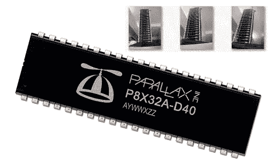

# 海龟一路向下，40 螺旋桨单片机摩天大楼

> 原文：<https://hackaday.com/2010/10/08/turtles-all-the-way-down-40-propeller-mcu-skyscraper/>

为什么要把 40 个螺旋桨微控制器一个接一个地连接起来呢？当然是为了来自并行处理的能力！[Humanoido]将总共 1280 个端口、640 个计数器等设置放在一起，所有这些都以每秒 64 亿条指令的速度运行，据我们统计，价格低至 300-500 美元。“摩天大楼”甚至配有完整的软件和图表，向开发商承诺有能力扩展或适应任何风险。为什么我们首先需要这样的设置？用于以下任何方面:视觉跟踪/修改、人工智能、高级机器人控制或更多。

相关:[类人机器人]喜欢把微处理器组装在一起，看看他的另一个发明[基本邮票超级计算机](http://hackaday.com/2008/11/24/a-basic-stamp-supercomputer/)。

[感谢 Logan996]