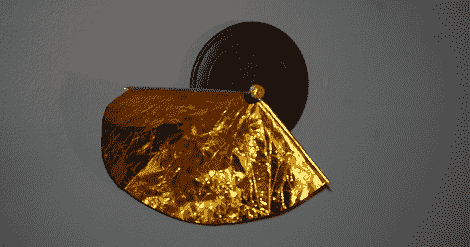
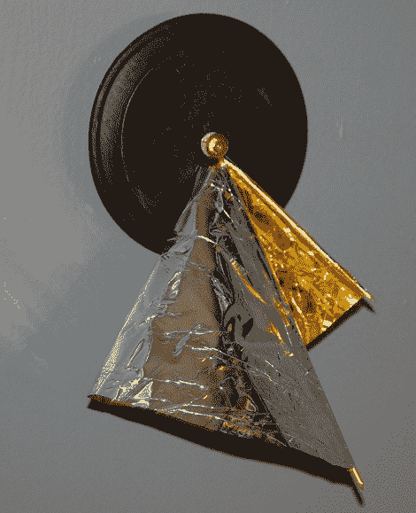
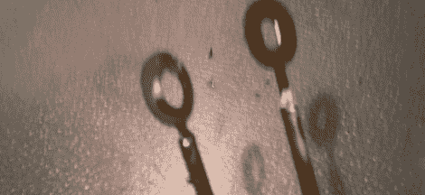
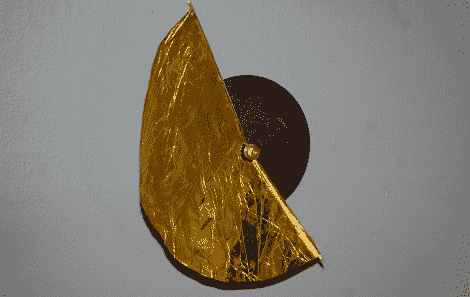

# 教程:花 10 美元建造一个流形时钟

> 原文：<https://hackaday.com/2012/01/25/tutorial-build-a-manifold-clock-for-10/>

每隔一段时间，Hack a Day tip line 就会收到一份很酷的提交材料，但要求在几个小时内完成，可能是在喝成人饮料的时候。当[Shay]和[Ben]提交他们的[多种时钟 Kickstarter](http://www.kickstarter.com/projects/manifoldclock/manifold-clock-telling-time-in-3d) 时，我知道我必须做什么。长话短说，现在我的墙上挂着一个多面钟。休息之后，请查看我的多种时钟操作指南。

正如 Studio Ve 的[Shay]和[Ben]所设计的，流形时钟在三维空间中显示时间，并基于 [log z 黎曼曲面](http://en.wikipedia.org/wiki/File:Riemann_surface_log.jpg)。这是他们在 Kickstarter 上发布的视频:

[https://player.vimeo.com/video/33896599](https://player.vimeo.com/video/33896599)

如你所见，这不是一个非常复杂的构建。这个版本有三个基本组件。首先，时钟驱动:在任何一家工艺品商店都可以买到，价格大约为 5 美元。其次，时钟指针:没有多少时钟驱动器配有 6 英寸长的分针，但我可以让一些东西工作。最后，双手之间的带子。官方版本的歧管钟使用特卫强抗撕裂，但我想出了一样酷的东西。

为了创造长时钟指针，我重新利用了时钟驱动附带的时钟指针。通过切掉时针和分针的最大部分，我只剩下一小片黄铜，可以连接到时钟的轮毂上。当我在业余爱好商店的时候，我也买了一些铜管。通过焊接外径为 0.1”或 2.5 毫米的铜管，将时钟的指针延长:

原谅这张可怕的照片。如果有人愿意为 D40 捐赠微距镜头，我会欣然接受。

把钟的指针切成一定长度后，一切都简单了。现在我们来构建时钟指针之间的带子。

接下来的两段相当无聊。公平的警告。

如果你想创建自己的流形，只需启动你最喜欢的 CAD 软件包，并开始工作。对于我的流形，我首先画了一个与分针半径相同的圆，另外两个是时针和中心的圆。我用了一个直径为半英寸的圆作为中心——刚好够清理时钟驱动的轮毂。[在时针的圆圈上刻一个 12 边形](http://hackaday.com/wp-content/uploads/2012/01/3.png)，画出[时针](http://hackaday.com/wp-content/uploads/2012/01/4.png)。我在 5 点钟画了我的，虽然这只是看视频时粗略的猜测

如果你不太了解你的绘图包，下一步可能会有点困难，但幸运的是，使用指南针和直尺结构可以很容易地完成。我让你自己把欧几里得的那个拿出来。[平分](http://hackaday.com/wp-content/uploads/2012/01/5.png)时针和分针，然后[以分针和时针的平均值为半径画一个圆](http://hackaday.com/wp-content/uploads/2012/01/6.png)。[从分针尖端画一条弧](http://hackaday.com/wp-content/uploads/2012/01/7.png)，穿过你刚刚画的等分线和圆的交点，终止于时针尖端。[擦掉几条线](http://hackaday.com/wp-content/uploads/2012/01/8.png)，[在](http://hackaday.com/wp-content/uploads/2012/01/9.png)上放几个拉环上胶，就大功告成了。

为了让每个人都不必复制我的工作，我为我的时钟薄膜创建了一个 [PDF 文件](http://hackaday.com/wp-content/uploads/2012/01/clockmembrane.pdf)。该模板的大小适合 5.5 英寸长的分针和 3 英寸长的时针。你想怎么处理就怎么处理。

歧管钟在时针和分针之间使用一块 Tyvek 用于连接。如果你足够在意开车到一个新的开发项目，并在垃圾箱里翻找一张家用包装纸，特卫强可以免费提供，但我想让我的闹钟更有档次一点。我的织带是用聚酯薄膜(来自一个“紧急露营毯”或聚酯薄膜气球)制成的，在一侧粘有一层 [Kapton](http://en.wikipedia.org/wiki/Kapton) 胶带。Kapton 胶带最初是为我的 RepRap 的加热床和热端购买的，但当我意识到[阿波罗登月小艇](http://en.wikipedia.org/wiki/Apollo_Lunar_Module)上的金箔是聚酯薄膜和 Kapton 的层压材料时，我不得不尝试一下。结果是一层非常耐撕的银色和金色薄膜:

哦，对了，你还得把分针弯得比时针高。

按照模板裁剪好我的金银膜后，剩下唯一要做的就是组装时钟了。将表链上的标签缠绕在时钟的指针上，确保指针可以绕着金属箔自由旋转。根据说明将指针组装到时钟机械装置上，并将其安装在某种外壳中。我用一个五十美分的圆形钟面:

到目前为止，这个钟已经挂在我的墙上 38 个小时了，它仍然走得很准。我要称之为成功。这是时钟运行的延时:

[https://www.youtube.com/embed/RsgbDECkpHM?version=3&rel=1&showsearch=0&showinfo=1&iv_load_policy=1&fs=1&hl=en-US&autohide=2&wmode=transparent](https://www.youtube.com/embed/RsgbDECkpHM?version=3&rel=1&showsearch=0&showinfo=1&iv_load_policy=1&fs=1&hl=en-US&autohide=2&wmode=transparent)

这个构建的费用是一个时钟机制 5.99 美元，一个小铜管 2.99 美元，一个未完成的钟面 0.50 美元，共计 9.49 美元。当然，我没有计算聚酯薄膜、Kapton、焊料、油漆和烙铁的成本，但你明白了。

遗憾的是，我的闹钟没有秒针，而且嘀嗒声也不大，所以根本不可能有兽医用的闹钟。如果有人有足够的勇气用秒针建造一个多面钟，[把它送进](http://hackaday.com/contact-hack-a-day/)。我们会把它挂起来。