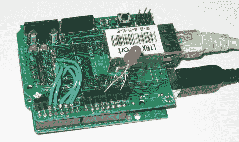

# Twilio 为 Arduino 增加按键式电话控制

> 原文：<https://hackaday.com/2010/05/09/twilio-adds-touch-tone-telephone-control-for-arduino/>

一个带以太网屏蔽的 Arduino，没什么新鲜的吧？不完全是，[Chris]正在向我们展示如何使用 Twilio 通过按键电话控制 Arduino。我们以前在手机视频游戏中看到过 [Twilio，但这一次音频菜单系统开始发挥作用。您可以制作自己的菜单，当您拨打 Twilio 号码时，](http://hackaday.com/2010/03/01/phonewebapp-written-in-ploy-to-appear-more-popular/)[WOPR](http://en.wikipedia.org/wiki/WOPR)(休息后见演示)将会读取菜单选项。这个应用程序只是打开和关闭一个 LED，但一旦你有了 Arduino 的访问权限，天空是无限的。最直接的是，这对于我们见过的所有[手机门锁系统](http://hackaday.com/2010/02/23/more-cellphone-controlled-door-locks/)来说都是一个简单的实现。我们还设想了一些经典的家庭自动化，如喂猫或开灯。

【http://www.youtube.com/watch?v=RYu_e4P3Y-4】