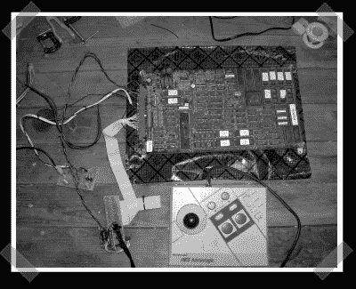

# 本·赫克的两个学位指南

> 原文：<https://hackaday.com/2008/04/30/two-degrees-of-ben-heck-how-tos/>

【瑞安】送来了【比尔】的[项目](http://www.billkuker.com/wiki/index.php/Jamma_to_Console_Conversion)来打造自己的 JAMMA 街机游戏主机。这实际上是从[本·赫克]的[指南](http://www.engadget.com/2006/11/28/how-to-consolize-an-arcade-game/)中摘录的，但我认为它可能会引起那些认为自己无法完成我们所展示的任何项目的人的兴趣。我们当然喜欢展示一些原创的、复杂的黑客技术，但成功的故事也同样鼓舞人心。

*   [永久链接](http://www.billkuker.com/wiki/index.php/Jamma_to_Console_Conversion)