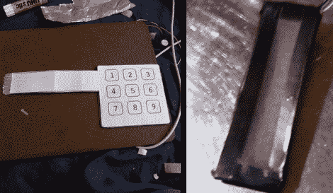

# 用普通物品制成的两个输入设备

> 原文：<https://hackaday.com/2010/02/27/two-input-devices-made-with-common-items/>

这里有两种输入设备，你可以很容易地用手头的材料制作。

在左边，[John]用纸和锡纸搭建了一个 3×3 [的键盘矩阵。这些行和列是由纸的正面和背面的锡箔条组成的。各层之间用海绵双面胶带隔开。当你用手指挤压导体之间的间隙时，就会产生“按键”现象。](http://www.instructables.com/id/Create-own-Membrane-Matrix-Keypad-and-hooking-it-/)

以大致相同的方式，[戴夫·弗莱彻] [制作了一个触摸电位计](http://fletchtronics.net/diy-touch-potentiometer)。他用铅笔芯在纸上乱涂乱画，做了两块电阻板。当两个板彼此面对，被与之前相同类型的泡沫胶带分开时，它们可以被压在一起以形成具有可变电阻的电路。这就产生了一个粗糙版本的 [SparkFun 软罐](http://www.sparkfun.com/commerce/product_info.php?products_id=8607)。