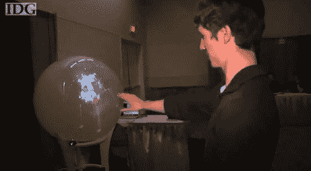

# 两台 Kinects 加上一台高清投影仪，打造出有史以来最酷的“雪花球”

> 原文：<https://hackaday.com/2011/06/04/two-kinnects-plus-one-hd-projector-makes-the-coolest-snowglobe-ever/>

想找个东西来代替十年前在你家惊艳的平板显示器？类似雪花玻璃球(水晶球)的圆形[显示器怎么样？)无论从哪个角度观看，都能正确显示您正在观看的图像。](http://www.engadget.com/2011/05/19/hacked-kinect-duo-teams-up-with-hd-projector-to-make-360-snowglo/ ""snowglobe" display")

皇后大学的这个令人惊叹的学生项目结合了许多黑客熟悉的元素，包括:Kinect 传感器、3-D 投影仪和一个巨大的丙烯酸球体。事实上，大多数人从未使用过巨大的丙烯酸球体，但它们看起来很有趣。休息之后请看视频。

[https://www.youtube.com/embed/43D4QJe9vqM?version=3&rel=1&showsearch=0&showinfo=1&iv_load_policy=1&fs=1&hl=en-US&autohide=2&wmode=transparent](https://www.youtube.com/embed/43D4QJe9vqM?version=3&rel=1&showsearch=0&showinfo=1&iv_load_policy=1&fs=1&hl=en-US&autohide=2&wmode=transparent)

最终的显示是一个“伪 3D”图像，因为你看到的不是三维的，而是看起来是三维的。Kinect 会跟踪用户的位置，并相应地调整视图。此外，手势可用于放大或缩小对象、旋转对象以及将对象更改为其他对象。如果你喜欢这个，一定要使用一些类似的技术来看看这个[“人跟踪球”](http://hackaday.com/2011/03/21/people-tracking-orb-demo-makes-us-want-to-build-our-own/ "the "people tracking orb"")。