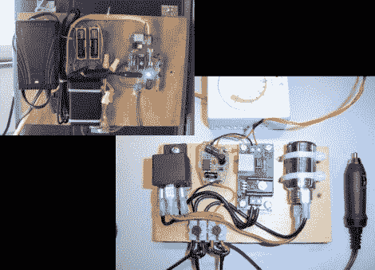

# 将电冷却器转换成保湿器的两种方法

> 原文：<https://hackaday.com/2011/11/27/two-ways-to-convert-an-electric-cooler-to-a-humidor/>

从技术角度来说，这不是一个合适的保湿器(没有任何特定的方法来调节湿度)，但[Dzzie]想出了一些方法来让他的雪茄在炎热的夏天保持凉爽。

两个版本都使用科尔曼电动冷却器作为外壳。这种硬件使用帕尔贴装置来保持内部冷却。第一次尝试使用恒温器是通过增加一个外部继电器来切换主电源。一个恒温器刻度盘悬挂在冷却器内部，向继电器板提供反馈。这是可行的，但这是一个非常迂回的方法，因为冷却器在 12V 下工作，这种方法使用电源到 12V 的适配器。如果[Dzzie]决定上路，当冷却器由汽车中的 12V 点烟器供电时，继电器将不会工作。

第二个版本解决了这个问题。他改用 12V 继电器，并使用车载手机充电器来提供他的控制电路运行所需的 5V 稳压电源。