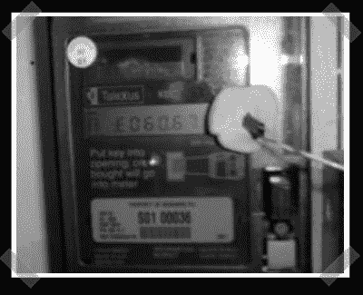

# 英国电表监控器

> 原文：<https://hackaday.com/2007/05/30/uk-power-meter-monitor/>

【约翰】送来了他版本的一个[功率表监控器](http://offog.org/code/electricity.html)。它被设计用来监控电表上的闪烁灯，以监控当前的用电量。灯的闪烁与使用的电量成比例，所以这是一个使用 ldr/光敏电阻捕捉输出并将其输入到他的计算机的并行端口的问题。最后，他使用一个 shell 脚本将数据输入 MRTG。

*   [永久链接](http://offog.org/code/electricity.html)