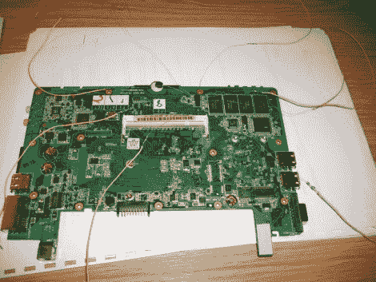

# 在 Arduino 的帮助下解绑

> 原文：<https://hackaday.com/2010/06/14/unbricking-with-the-help-of-arduino/>

 A

这台砖砌的 Eee 电脑以大约 50 美元的价格卖给了[Janzo]。它一切都很好，除了失败的 bios 更新使它对上一个主人毫无用处。[Janzo]开始使用 Arduino 来修复 BIOS。他查阅了存储 bios 的 EEPROM 的数据表，并做了一些微妙的焊接，以获得设备上的电源和数据引脚。经过一点尝试和错误，他能够阅读寄存器。在一个十六进制编辑器中，输出文件和官方 Eee PC bios 文件之间的一些比较证实，前 80 个字节是好的，但在那之后就有问题了。在编写了一个快速的 Python 脚本后，[Janzo]刷新了芯片，让电脑重新启动并运行起来。

我们以前见过 [Eee PC bios 恢复](http://hackaday.com/2009/09/25/eee-pc-bios-resurrection/)。这是一个非常简单的方法，因为它利用了我们在 Arduino 中发现的简单性。干得好。