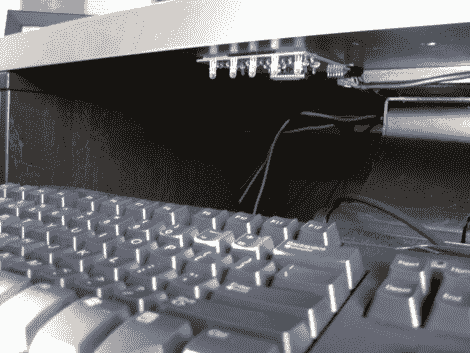

# 桌下 RGB 键盘照明

> 原文：<https://hackaday.com/2010/11/11/under-desk-rgb-keyboard-lighting/>

房间里很暗，他看不清键盘。但是把灯扔在桌子下面似乎不够酷。相反，他建造了一个由他的桌面控制的 RGB 灯板。该板基于 ATmega328 和 Arduino booloader。他蚀刻了一个单面 PCB，将其连接到一组五个 RGB LEDs，并带有一个用于 FTDI 电缆的编程头。该板通过串行连接与 PC 通信，使用 C#控制应用程序[Jay]编码来控制颜色。休息之后，我们嵌入了几个视频，但请查看他的页面，获取一组代码和高清图片。

如果你想要一些很酷的东西，需要更少的工作来构建，看看这个链接文章中的 EL-wire 键盘[。](http://hackaday.com/2010/08/22/hackaday-links-august-22-2010/)

[https://www.youtube.com/embed/dtvuBaSUJco?version=3&rel=1&showsearch=0&showinfo=1&iv_load_policy=1&fs=1&hl=en-US&autohide=2&wmode=transparent](https://www.youtube.com/embed/dtvuBaSUJco?version=3&rel=1&showsearch=0&showinfo=1&iv_load_policy=1&fs=1&hl=en-US&autohide=2&wmode=transparent) [https://www.youtube.com/embed/H2rnBi3CSaE?version=3&rel=1&showsearch=0&showinfo=1&iv_load_policy=1&fs=1&hl=en-US&autohide=2&wmode=transparent](https://www.youtube.com/embed/H2rnBi3CSaE?version=3&rel=1&showsearch=0&showinfo=1&iv_load_policy=1&fs=1&hl=en-US&autohide=2&wmode=transparent)