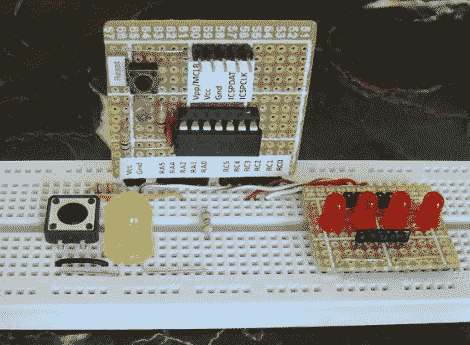

# 理解 PIC 微控制器中的中断

> 原文：<https://hackaday.com/2011/07/26/understanding-interrupts-in-pic-microcontrollers/>

中断是多功能微控制器固件的游戏名称。[Rajendra]刚刚发布了一个教程，涵盖了 PIC 16F688 微控制器的所有[中断类型。他概述了所有要点:什么是中断，中断的原因是什么，如何阅读数据手册(常常被忽略)来设置中断，最后他将它应用于一个测试平台和一些代码。](http://embedded-lab.com/blog/?p=3180)

我们在周末又玩了一次 Arduino，对中断的限制有点失望。这个问题涉及 AVR 中断，[一个我们已经很熟悉的话题](http://hackaday.com/2010/09/27/beginner-concepts-all-about-avr-interrupts/)。但是我们很少使用 PIC 硬件，探索另一半是如何工作的很有趣，包括硬件和代码。