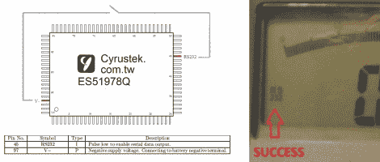

# 在万用表上解锁 RS232 串行通信

> 原文：<https://hackaday.com/2010/11/30/unlocking-rs232-serial-comm-on-a-multimeter/>

【Craig】撬开万用表[解锁 RS232 串行通信](http://flashingleds.wordpress.com/2010/11/30/unlocking-rs232-output-from-your-multimeter/)可用于数据记录。有几件事使这成为可能。首先，万用表的处理器没有被黑色环氧树脂覆盖，使引脚暴露在外，容易被黑客攻击。第二，芯片型号是已知的，[Craig]能够拿到数据手册。当脉冲变为低电平时，其中一个引脚使能串行输出。触摸到 V- even 会打开显示屏上的 RS232 图标，如上图所示。为了在不打开外壳的情况下实现这一点，可以添加一个瞬时按钮，以及用于信号输出的连接器，并在 PC 端进行一些解析以处理输入的数据。