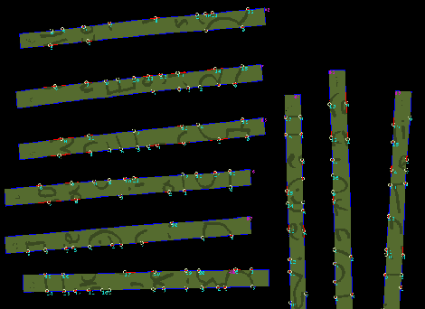

# 不脱线纸

> 原文：<https://hackaday.com/2012/01/10/unshredding-paper/>

[Roel]读到人们赢得了 DARPA 碎纸机挑战赛，但他们的技术是保密的，他对这个概念很感兴趣，他还记得 X 档案中的一集，其中他们使用计算机系统重建了碎纸。与大多数基于电脑的电视节目不同，这看起来并不太难，所以他开始自己尝试。

首先写一张纸条，然后切成条，条被扫描进电脑，奇迹就在这里发生了。接下来，每一条都用多边形勾勒出来，然后软件会沿着多边形轮廓寻找像素级的颜色变化。然后，软件进入模式匹配模式，并根据评分系统重新组合试卷。

虽然没有多少人再使用老式的条状粉碎机，但基本的想法是可行的，如果你真的想扩大，它可以应用于横切或颗粒粉碎机。