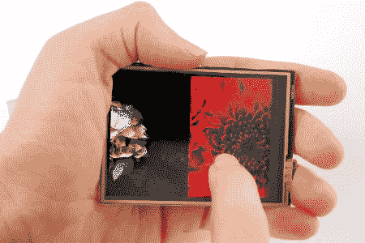

# 更新:微触摸 8 位 Ipod Touch

> 原文：<https://hackaday.com/2011/01/31/update-microtouch-the-8-bit-ipod-touch/>

看起来[rossum]和[Ladyada]已经合作了，并且正在忙着做[微接触](http://www.ladyada.net/products/microtouch/)。自从我们去年在[报道后](http://hackaday.com/2009/11/03/8-bit-device-quenches-iphone-envy/)，它有了一些小的改进，比如升级了 ATmega32u4 微处理器和一些新软件。新的和改进的 microtouch 还具有一个加速度计以及一些软件。另外，它现在在 [adafruit](http://www.adafruit.com/index.php?main_page=product_info&cPath=51&products_id=330&zenid=51ff46d57530be73424c64de5ac3015d) 上出售，价格大约是 ipod touch 的四分之一(以防你不想自己做)。

不知道的是，microtouch 是一款基于 AVR 的轻量级 ipod touch。它带有一个引导程序，允许你下载你的“应用程序”到 microtouch，而不需要 AVR 程序员。虽然它可能缺乏 ipod touch 的一些计算能力和功能(如音乐)，但 microtouch 无疑因其开放的硬件/软件和易于使用的触摸屏而具有吸引力。