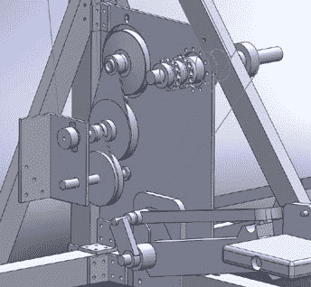

# Stairmonster 更新

> 原文：<https://hackaday.com/2011/02/09/update-to-stairmonster/>

“ [Stairmonster 2](http://www.ericfeldman.com/stairs) ”是我们在 11 月报道的超高速、家庭酿造的 stairmaster [的更新版本。它仍然具有其原始版本的大部分功能，包括非常坚固的结构，心率监视器和 320×240 触摸屏界面。Stairmonster 2 的新颖之处在于它的把手。V1 使用固定的自行车把手，这对引体向上或其他类似的练习很有好处，但在机器上没有多大用处。](http://hackaday.com/2010/11/24/the-quest-to-build-a-better-stairmaster/)

另一方面，版本 2 使用移动手柄，当与机器的阻力配对时，允许用户模拟攀爬动作。手柄也连接到旋转滑动离合器上，所以在拉的过程中只有阻力，而在收回的过程中没有阻力，这在这东西的速度下会非常糟糕。

总的来说，对一台已经令人印象深刻的机器来说是一个很好的改进，尽管不要期望很快看到我们爬上它。