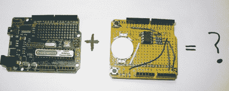

# 用实时时钟升级 Freetronics Twentyten

> 原文：<https://hackaday.com/2010/10/07/upgrading-the-freetronics-twentyten-with-a-real-time-clock/>

[约翰·鲍克夏尔]发现自己做了大量需要实时时钟的项目。他快速频繁地制作原型，通常使用 [Freetronics twentyten](http://www.freetronics.com/products/twentyten) ，这是一种 Arduino 替代品，拥有一些功能，如漂亮的原型制作区域、边缘可见的 led 和迷你 USB。然而，缺少的是一个实时时钟。他没有制作另一个盾型系统，只是想在他的板上永久增加这个功能。他说整个过程都被拍了下来，并向任何想跟随他的人做了很好的解释。