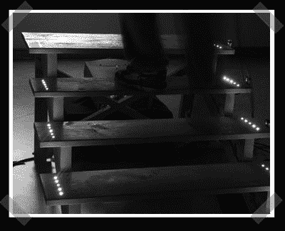

# 城市声音体验

> 原文：<https://hackaday.com/2008/02/29/urban-sound-experience/>

【Christiane】在[送来一个在德国维尔茨堡应用科技大学准备的项目](http://gestaltung.fh-wuerzburg.de/blogs/reconqr/?author=6)。这个想法是在不同的城市体验不同高度的城市声音。当在台阶上检测到脚时，体验改变以模拟高度的增加。一副环绕声耳机，一些接近传感器，一个 Arduino 和 instantaudio 让一切都正常工作。

*   [永久链接](http://gestaltung.fh-wuerzburg.de/blogs/reconqr/?author=6)