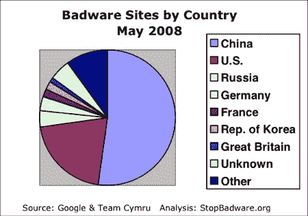

# 美国和中国是大多数恶意软件的宿主

> 原文：<https://hackaday.com/2008/06/25/us-and-china-host-majority-of-malware/>

【StopBadware.org】已经发布了他们【2008 年 5 月感染病例报告 (PDF)。他们获得了当前 21.3 万个活跃恶意软件网站的列表，并解析了 IP 地址。这些地址用于确定网络块的所有者和国家。结果可能会偏向谷歌更频繁扫描的网络，但它们应该会给出一个像样的整体画面。中国拥有 52%的恶意软件网站，而美国只有 21%。没有其他国家保持超过 4%的份额。他们还计算了人均感染网站的数量，这也是中国领先的。去年的报告导致几个 AS 块维护者清理到他们今年甚至没有进入前 250 名的地步。

*   [永久链接](http://www.stopbadware.org/pdfs/StopBadware_Infected_Sites_Report_062408.pdf)