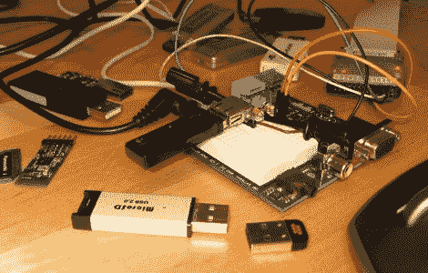

# Propeller Micros 的 USB 主机

> 原文：<https://hackaday.com/2010/04/05/usb-host-for-propeller-micros/>

[Micah Dowty]已经在 Propeller 微控制器上实现了[全速 USB 主机控制。他的动机是在他的项目中使用基于 USB 的 WiFi 和蓝牙加密狗作为现成的解决方案。我们已经看到了使用 Arduino](http://forums.parallax.com/forums/default.aspx?f=25&m=440787) 的 [USB 主机控制，它通过存储、无线连接和用户界面真正打开了推进您项目的闸门。](http://hackaday.com/2010/02/01/game-controllers-using-usb-host-shield/)

到目前为止，他的工作是相当初步的，但从视差论坛的其他参与者看到的结果是非常积极的。从 subversion 库查看他的代码，并帮助开发。

[通过[阿达果](http://www.adafruit.com/blog/2010/04/02/breaking-news-bit-banging-full-speed-usb-host-for-the-propeller/)感谢斯特凡]