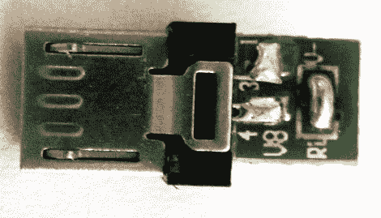

# Droid 的 USB 主机模式

> 原文：<https://hackaday.com/2010/02/10/usb-host-mode-for-droid/>

有一个简单的方法可以将你的摩托罗拉 Droid 手机用作 USB 主机。这是一种纯硬件的黑客技术，不需要你打开手机，，甚至不需要改变固件(尽管现有 Android 映像中的设备驱动程序可能非常有限)。当手机启动时，上面的加密狗被用作启动模式的钥匙。这是通过移除电线和电阻并短路电阻垫从汽车充电电缆中重新利用的。一旦手机处于主机模式，加密狗就会被换成一个简单的 USB-mini 到 USB-A 插座适配器，由你可能身边的两根电缆组成。现在你可以插入任何你想要的设备。

[感谢冰柜 90]