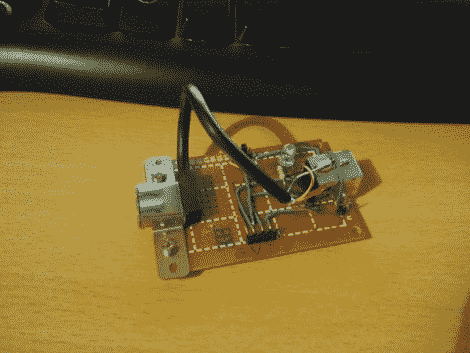

# USB 中间人适配器

> 原文：<https://hackaday.com/2011/03/16/usb-man-in-the-middle-adapter/>

该模块作为通道工作，为 USB 设备提供对数据和电源线的[访问。[BadWolf]建造它是为了嗅出外设和通用串行总线之间的通信。目前，它只是提供不同信号的访问，但我们认为这很有用。首先，电源轨被映射到一个跳线，这使得监控电压稳定性或插入万用表以获得电流消耗的反馈变得非常简单。但你也可以在前景中看到，引脚插座使得使用跳线接入电路板变得很容易。我们认为这将是一个伟大的 USB 工作的试验板适配器，将继续有用后，你已经填充了原型的第一个 PCB。](http://badwolf.hackhut.com/2011/03/15/usb-analyzing-dongle-and-set-up/#)

[BadWolf]对此有其他的计划。他想截取并破译数据线上的通讯。在休息后的视频中，他提到了使用总线盗版的可能性(我们对此有所怀疑)，但计划用一个 [STM32 发现套件](http://hackaday.com/2010/10/12/arm-prototyping-on-the-cheap-with-stm32-discovery/)开始他的测试。我们迫不及待地想看看他会想出什么。