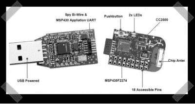

# USB 微控制器开发/仿真棒

> 原文：<https://hackaday.com/2008/05/18/usb-microcontroller-devemulation-sticks/>

【naze rine】发来【伊曼纽】的[列表](http://dev.emcelettronica.com/microcontrollers-usb-stick-tool)有趣的 USB 微控制器开发工具。他们中的一些人对于你所得到的东西出奇的便宜。对于开发远程项目来说，[无线开发/仿真棒](http://focus.ti.com/docs/toolsw/folders/print/ez430-rf2500.html)看起来格外有趣。(购买环节是通过制造商进行的——起初我以为他可能在卖东西)

*   [永久链接](http://dev.emcelettronica.com/microcontrollers-usb-stick-tool)