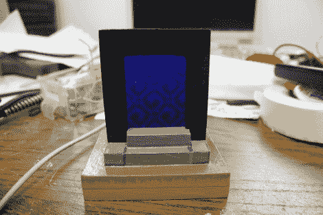

# USB《我的世界》门户

> 原文：<https://hackaday.com/2011/05/06/usb-minecraft-portal/>

[Sprite_tm]前一段时间听说诺基亚手机有一些非常有趣的 LCD，它们是 2.4 英寸 TFT，分辨率为 320×240。他立即得到了 3 个，因为它们的成本也很低，并开始使用它们。显然，这些液晶显示器是独立的，这意味着它们有所有的驱动芯片和内存，你只需要知道引脚和命令。这也相当容易，因为它们是标准设置，类似型号的数据手册在必要时也能工作。

一旦这些东西工作了，你会怎么处理它们？[Sprite_tm]决定做一个[桌面 minecraft 门户](http://spritesmods.com/?art=mcportal)。由于动画在微控制器世界中有点复杂，他抓起一个 STM 32 f 101 CB 作为他们结实的 cpu，开始工作。从 minecraft 获取纹理被证明是一件有点麻烦的事情，因为它们不是静态图像，而是在启动时计算的。PC 上的一点 C 代码迅速生成一个适当的模式，并输出到微控制器，在最终的家中显示。

这个箱子是木制的，一旦完成，看起来就像是任何“傻瓜”都想放在他们桌子上的“真实”的东西。