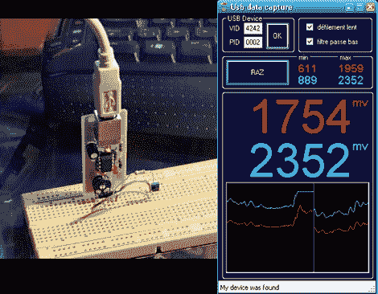

# USB 示波器

> 原文：<https://hackaday.com/2010/03/05/usb-oscilloscope/>

这是几年前的一个 USB 示波器项目。它很容易在单面 PCB 上构建，并且非常便宜，因为它只使用少量的器件。在中心，ATtiny45 微控制器利用其 ADC 功能处理两条走线，并处理 USB 连接。使用内部振荡器，并通过参考 USB 时钟来调整精度。在 PC 端，用 C#编写的程序显示来自串行总线的数据。快，小，有用；原理图、电路板布局、固件和 PC 软件资源均可下载。

[谢谢 Shri]