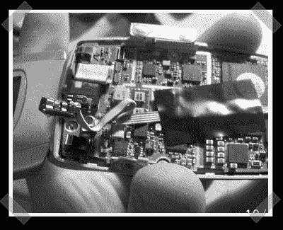

# USB 端口电话黑客

> 原文：<https://hackaday.com/2006/10/14/usb-port-phone-hack/>

这一个更像是一个案例 mod 而不是真正的黑客——【computer guru 365】将一个女性 mini-b USB 端口[插入他的三星](http://computerguru365.blogspot.com/2006/10/add-usb-port-to-your-cell-phone.html)【thx rsilvawashington】以避免购买价格过高的诺基亚线(让我想起臭名昭著的 65 美元 startac 串行线)我喜欢它，内部手机硬件黑客并不经常出现，他发现了这些无用的演示手机之一的用途。

*   [永久链接](http://computerguru365.blogspot.com/2006/10/add-usb-port-to-your-cell-phone.html)