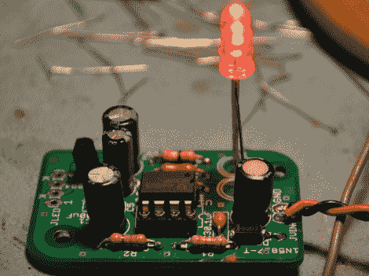

# 使用 555 定时器为经典街机添加“免费游戏”功能

> 原文：<https://hackaday.com/2012/01/07/using-555-timers-to-add-free-play-functionality-to-classic-arcade-machines/>

[John Zitterkopf]正在为即将到来的 2012 年德克萨斯州弹球节恢复一款老式世嘉星际迷航船长椅街机游戏，尽管该游戏的一个先决条件是支持某种免费游戏模式。在这一点上，他没有为设备寻找免费 ROM 的选择，所以他不得不自己想出一个解决方案。

他不想以任何显著的方式改变机器的操作，这意味着保留硬币滑槽的功能。为此，他组装了一个小电路，使用一对级联的 555 定时器为机器提供适当的信号，以模拟硬币插入，同时仍然接受硬币。你可能最初认为这可以通过短路硬币滑槽中的一对触点来轻松实现，但正如[John]解释的那样，这个过程比那要复杂一点。

如果你有一些旧的街机游戏，并且正在寻找一种非侵入性的方式让它们免费玩，一定要查看他的网站的原理图和完整的 BoM。