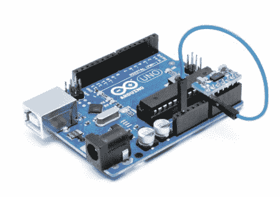

# 在 Arduino 上使用廉价的加速度计会带来一个问题

> 原文：<https://hackaday.com/2012/02/10/using-a-cheap-accelerometer-with-arduino-comes-with-a-catch/>

[Boris Landoni]用一个廉价的三轴加速度计和 Arduino 组合成了一个[指南。他为该练习选择的芯片是飞思卡尔制造的 MMA7455L。它有许多很好的功能，使用硬件来做一些其他芯片需要软件做的事情，如报告芯片移动的方向，检测移动何时停止，等等。这是一个 I2C 设备，所以他提供的例子可以非常简单地移植到你选择的 uC 上。](http://www.open-electronics.org/mma7455l-three-axis-digital-output-accelerometer/)

但是正如标题所说，这里面有一个陷阱。这种芯片用途极其广泛，不到 2 美元就能买到。但是看看它的大小。这是一种 DFN(双扁平无引脚)封装，也就是说上面没有引脚。封装底部有焊接触点，不会从侧面突出。如果你想用芯片[做一些家庭原型制作，你需要一个热风铅笔或回流装置](http://hackaday.com/2010/05/04/qfn-or-mlf-soldering-without-solder-paste/)，因为手工焊接不太可能成功。我们不是说这不可能，但是[这是相当棘手的](http://hackaday.com/2011/04/26/small-pov-device-shows-off-some-big-features/)。

当然，如果你有用优质烙铁完成这项工作的秘诀[，我们很想听听这个秘诀](http://hackaday.com/contact-hack-a-day/)。