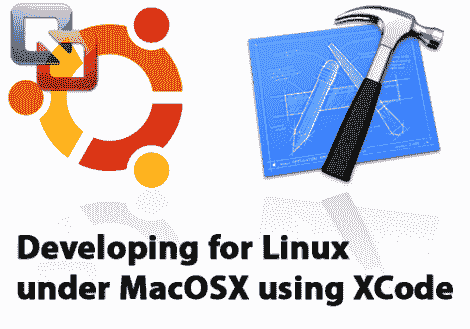

# 使用 Mac 和 XCode 作为 Linux 开发平台

> 原文：<https://hackaday.com/2012/01/09/using-a-mac-and-xcode-as-a-linux-development-platform/>

[Ricard Dias]来信告诉我们关于他在 Mac 上开发 Linux 应用程序的指南。他真的很享受 XCode 提供的开发环境，让它成为 Linux 开发的一体化解决方案并不需要太多。

这里真正的技巧是使用 SSH 来访问 Linux 环境。在这个例子中，他使用 Ubuntu 作为虚拟机运行，但也提到了同样的事情可以通过一个单独的机器轻松完成，只要它与 Mac 在同一个网络上。SSH fs(SSH 文件系统)允许他在本地 Linux 机器上挂载开发目录。这是存储 XCode 项目和文件的地方，但是构建程序将由 Linux 机器通过 SSH 调用 make 命令的脚本来完成。为了测试新构建的程序，[L]使用 X11 转发 ssh，应用程序将在 OSX 显示为一个窗口，尽管它运行在 Ubuntu 机器上。

我们喜欢 SSH，并且一直在使用它。[能有多手真是太神奇了](http://hackaday.com/2010/12/25/a-hackers-marginal-security-helps-return-stolen-computer/)。