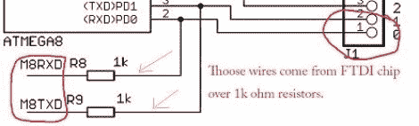

# 为其 FTDI 芯片使用 Arduino 或 Seeeduino

> 原文：<https://hackaday.com/2010/10/09/using-an-arduino-or-seeeduino-for-its-ftdi-chip/>

我们认为 Arduino 是一个快速原型开发工具，但我们以前从未想到它是一个 FTDI 分线板。[Ihsan Kehribar]写了一个简短的帖子来展示这是怎么做的。你可以在有 USB 接口的 Arduino 板上找到 FTDI 芯片。它一方面用于处理 USB 通信，另一方面用于处理 TTL 串行通信。芯片上的串行引脚映射到 AVR 芯片上的 UART，并依次出现在引脚接头上，以便于连接。只需加载一个非常简单的草图(可从 Ihsan 的帖子中获得)，以确保处理器不会碍事，并且您已经获得了一个 FTDI 分线板。如果您碰巧有一个 Seeeduino，则功能更多，因为该板有一个选择器开关，允许您在 5V 和 3.3V 之间选择。

这并不适用于最新一代的 Arduino T1，因为那些主板已经用 T2 T3 T4 atmega 8u 2 T5 取代了 FTDI 芯片。这基本上是和 ATmega8 与原生 USB 处理…花式。

[谢谢马库斯]