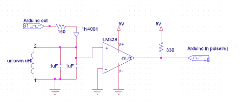

# 使用 Arduino 测量电感

> 原文：<https://hackaday.com/2011/07/24/using-an-arduino-to-measure-inductance/>

大多数万用表无法测量电感。通常需要一个高精度电阻(1%或更高)与电感串联，一个信号发生器通过电路，一个示波器测量结果。但是如果你手头没有这些工具，你能做什么呢？[Andrew Moser]有一个方法可以让你用一个 Arduino 和一个 LM339 四通道比较器来完成它。

该电路通过从 Arduino 输入信号来工作。该波形受 LC 电路影响，由比较器芯片滤波，然后由 Arduino 从另一端读取。产生的信号是方波，这是 Arduino 容易测量的目标。从方波测得的时序可以用来计算电感值。

如果你在给自己的电感上弦，这非常方便。现在你可以精确地调整你一直在研究的焦耳窃贼。

[via [危险原型](http://dangerousprototypes.com/2011/07/21/easily-measure-inductance-using-arduino/)和[阿达果](http://www.adafruit.com/blog/2011/07/20/easily-measuring-inductance-with-arduino/)