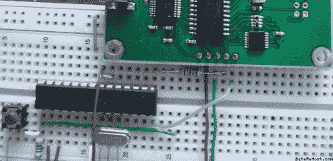

# 用 ATmega8 对 PIC24FJ 芯片进行编程

> 原文：<https://hackaday.com/2011/12/25/using-an-atmega8-to-program-pic24fj-chips/>

[Fezoj]喜欢玩微控制器，并决定他想尝试一个巴士海盗作为他冒险的新工具。由于它是开放式硬件，他自己制作了电路板，并自己组装。麻烦的是，他只用 AVR 芯片工作，没有 PIC 编程器。没问题，他知道如何使用 ATmega8 来刷新 PIC24FJ。

为了开始，他从 Microchip 上拿了一份 flash 编程规范。一旦他在 AVR 代码中实现了协议，就只需要将下载的 PIC 固件下载到 AVR 中。借助他自己用 Visual Studio 编写的编程软件，RS232 芯片为他提供了所需的串行连接。

对于 PIC 平台上的原型开发来说，这不是一个健壮的解决方案，但也许可以为此目的而开发。目前，他所需要的只是一个引导加载程序，这样他就可以通过 USB 连接闪存总线盗版。

[via [危险原型](http://dangerousprototypes.com/2011/12/23/avr-based-pic24fj-programmer-for-uploading-bus-pirate-firmware)