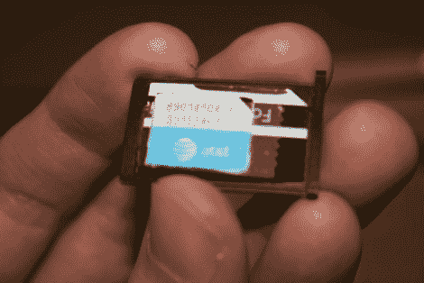

# 在 IPhone 上使用 IPad SIM 卡

> 原文：<https://hackaday.com/2010/05/14/using-ipad-sim-with-an-iphone/>

[Aaron Nelson]向我们透露了一个简单的破解方法，即在 iPhone 上使用 iPad SIM 卡。你不能把 iPhone 当手机用，但相对便宜的 29.99 美元的无限上网服务是他的目标。他用一张旧的塑料礼品卡为 iPad 的 micro SIM 剪出一个适配器，这样它就可以放入 iPhone 的 SIM 卡底座，如上图所示。在那里，他通过 WiFi 连接使用网络服务，输入“宽带”作为自定义 APN。