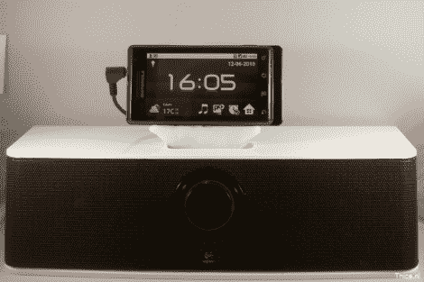

# 通过适配器将 IPod 基座与 Droid 配合使用

> 原文：<https://hackaday.com/2010/06/16/using-ipod-docks-with-droid-via-an-adapter/>

便携式设备中的标准连接器对消费者来说非常好，但这样一来，你就不会为你购买的任何便携式设备购买单独的外围设备了(在许可所述外围设备的公司的口袋里)。[Thijs]再也不能忍受了。意识到连接器的形状是唯一的障碍之一，他制作了一个适配器来与 Droid 一起使用 iPod 基座。硬件包括 USB 连接器、音频插孔、iPod 连接器和磁铁。在完成布线后，只需要用多态材料建造一个底盘[就可以了。正如你在上面看到的，他的昂贵的 dock 和 Droid 玩起来没有问题，因为他的工作很方便。](http://hackaday.com/2010/01/19/polymorph-in-practice/)