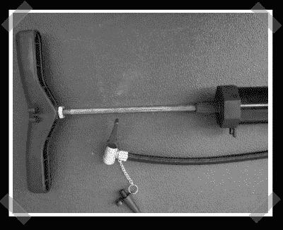

# 真空自行车泵

> 原文：<https://hackaday.com/2007/07/01/vacuum-bike-pump/>

【dr crash】发来了这篇彻底的如何把一个便宜的自行车打气筒改造成真空的文章。显然，这只是小型真空装袋项目的事情。我在想，这可以结合一个低转速电机和枢轴。想象一下一个老式蒸汽机车车轮驱动，你应该明白我的意思了。(挡风玻璃刮水器电机可能是完美的。)

*   [永久链接](http://www.instructables.com/id/EA58LR1F35J1I9N/)