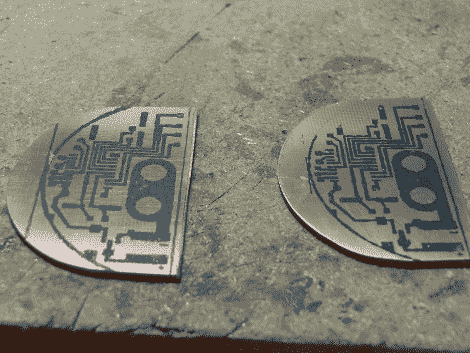

# 儿童 VGA 测试器

> 原文：<https://hackaday.com/2011/05/31/vga-testers-for-the-children/>

最近，在我们的 [Hack A Day 论坛](http://forums.hackaday.com/)上，一位成员询问了在我们的“请求和委托”论坛上为一家名为[世界计算机交易所](http://www.worldcomputerexchange.org/)的慈善机构制作一些 VGA 测试器的事情，该机构将旧的办公电脑进行更新，以供发展中国家的儿童在接受教育时使用。

我有点想做一个更简单的电子产品，因为那时我已经在 Apple II 天气显示器上工作了很长时间。我说没有更聪明的，因为我决定使用许多已经设计好的 vga 测试器中的一个，我真正要做的就是让它适合我们最终使用的任何盒子。

我选择 [deogen](http://hackaday.com/2008/08/05/deogen-tiny-monitor-tester/) 是因为它已经在 Hack A Day 上推出，支持多种光栅模式和分辨率(640×480 到 1280×1024)，已经相当小了，并且使用 ATTiny 2313，这很好，因为我已经为 AVR 微控制器设置好了。对于一个案例，我选择使用一些塑料“破冰者”薄荷盒，由于它们的椭圆形形状，使它比 altoids 罐小得多。挑战在于将 PCB、开关、9V 电池、2 个按钮和一个 vga 连接器塞进狭小的空间。

休息之后，请加入我们，获取大量图片和一些构建注释。

首先是零件。我从 good ole Digikey 那里得到了大部分需要的零件。有几个来自另一个项目的 radio shack 按钮，来自旧的死电源的拨动开关，VGA 连接器来自旧的多端口键盘/ vga 开关(其中一个有巨大的机械旋钮)。包括我手头上已经有的零件，一对这样的测试器的成本大约是 20 美元，虽然我得到的便宜一点。

你可以在主 [Deogen](http://www.eosystems.ro/deogen/deogen_en.html) 页面上找到原理图和零件清单，以及布局合理的双面 PCB。我不会使用印刷电路板，因为我有更少的空间来工作，我真的不喜欢钻孔，而且微，功率调节器和晶体被替换为相当容易处理的表面贴装封装。所有无源元件都是普通通孔，其引线焊接到板上的焊盘上。你见过表面贴装 18pf 电容吗？一开始我发誓 Digikey 给了我一盘空磁带！

在带锯上切割出 D 形 PCB 坯料，并用台式砂带磨光机磨平，并进行测试配合。如你所见，盒子里的所有东西都非常合适。起初我以为我要画这个 PCB，当我想起我需要做一对时，现实开始了。离开到 windows 和 [Express PCB](http://www.expresspcb.com/) ，在那里我迅速目测了一下我的 PCB 的 D 形状，并在圆形部分留出了相当多的空隙来展示我的设计。

我尝试了墨粉转移，我用尼龙垫，丙酮，钢丝绒和更多的丙酮擦洗空白，让那些东西干净。我去父母家用我爸的全新卡农激光打印机。我使用了旧的联邦快递运输标签纸的正面和背面，结果如何？

史诗失败！我从来不擅长制作墨粉转移板，但这是迄今为止最差的。墨粉不粘，有冒烟的问题。我用的铁是垃圾，所以它喜欢烫纸和拧铜表面。如果这还不够，我没有测量开关的底部，因为它太宽了，不适合我留在 PCB 上的 2 个孔。大约第三次后，我说“它不会变得更好”，我拿出我的小爱好刀和记号笔来解决任何问题。

蚀刻后，在放大的情况下，用一个配有一套焊钳的超小凿子挖出任何遗留的问题区域。两块板的每条迹线都用连续仪探测，然后所有的迹线都涂上液态助焊剂，准备镀锡。

镀锡是通过在一个大的接地层上聚集一滴焊料来完成的，你可以简单地用烙铁蘸一蘸，然后在走线上涂上油漆。它看起来很乱，因为过多的沸腾助焊剂导致表面不光滑，但一旦你开始在上面焊接，它就会很快变平。我还用牙刷和变性酒精擦洗电路板，这是至关重要的，否则电路板会被涂上一层粘稠的焊剂糖浆。

我在布局中将元件焊接到电路板上。不幸的是，在我的布局中，电路板是由按钮开关安装的。VGA 连接器必须在它和 PCB 安装后焊接，所以我需要从外壳开始。

首先，切割末端以适合 VGA 连接器。一个模板是由一个视频卡安装支架做成的，用胶带固定在适当的位置，粗略地剪下，用锉刀清理干净。将 PCB 和电池放置到位，并为电源开关做好标记。当我们在那里的时候，pcb 上的(修正的)开关安装孔被用来作为在薄荷盒底部钻孔的指南。

回到电源开关。我用我的数字卡尺测量了它，并在盒子底部划出了它的脚印，然后用美工刀把它切了出来。

在这一点上，我已经准备好安装盒子里的所有东西，但是我决定它也需要一些图形。跳回 windows，(因为我不能让我的 wifi 打印机/扫描仪在 linux 下正常工作)我把盒子放在我的平板扫描仪上，把图像导入 inkscape 用作模板。我画出了图形的轮廓，将生成的 svg 文件打开到 gimp for paint 中，并将其打印在粘贴在薄荷盒上的 feebee 照片纸上。

最后的构造包括首先将 VGA 连接器安装到盒子上。由于它位于盒子的圆形末端，连接器的螺丝凸片向内弯曲，以帮助匹配轮廓。接下来，pcb 滑到位，我现在可以通过 PCB 和盒子安装 2 个按钮。最后，电源开关被扣到位，并用一层相当厚的大猩猩胶加固。

最终布线是非常简单的 evn，虽然它在非常拥挤的条件下。我将 9v 电池夹的负极引线焊接到一根较长的导线上，然后将它焊接到 PCB 上的地线。正极引线穿过一个二极管，进入与电路电源输入相连的拨动开关。两个按钮的一侧焊接到地，另一侧分别连接到微控制器的不同引脚。最后，最困难的部分是连接来自 VGA 连接器的 6 条线。他们是；RGB 需要焊接到正确的电阻 dac，h sync 和 v sync 直接连接到微控制器，还有一条接地线(通过 vga 连接器上的跳线连接所有地)。

给胶水一些时间干燥，放入电池，盖上盖子(现在是底部)，你就可以开始了！两个 minty VGA 测试器都工作得很好，Deogen 设置在查找有缺陷的 LCD 时非常方便。不要只相信我的话，看看这些快乐的露营者！

> 多亏了你，我们才炸穿了一大堆液晶显示器！他们工作得非常好，我们正在考虑把他们中的一个派到我们 20 多个分会中的一个。每个月我们都有一组志愿者，他们是常客，有些人偶尔会来。你在合影中看到的每个人都为这项事业付出了很多时间。那里的每个人都对你的贡献印象深刻并表示赞赏