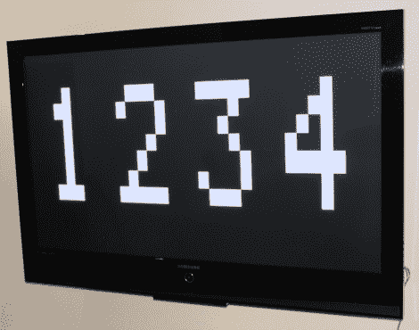

# 带附件的 VGA 视频输出

> 原文：<https://hackaday.com/2011/08/31/vga-video-output-with-an-attiny/>

[Fernando]正在家里制作一个游戏，现场得分显示在一个大液晶电视上。他对游戏内容保持沉默，但他非常乐意透露他计划如何将电视用作无线记分牌的细节。

这篇文章是一系列实质性进展报告的第一部分，包括他如何使用 ATtiny45 驱动他的 LCD 显示屏。最终，记分牌将使用蓝牙适配器进行无线输入，但他的直接目标是让显示器正常运行。

他解释了他如何使用微型计算机及其有限的 I/O 引脚来驱动显示器，并在此过程中探讨了一些技术细节。他讨论了他如何计算出 VSYNC 和 HSYNC 脉冲的时序，以及字符是如何在屏幕上绘制的。

这篇文章没有过多的技术细节，他有可用的示例代码，所以你可以看看 VGA 魔术是如何完成的，所以一定要去看看。