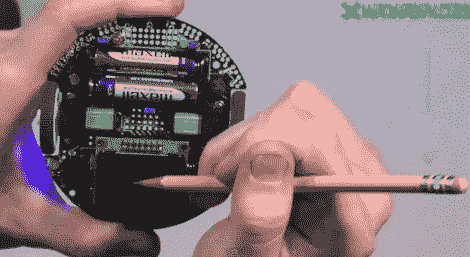

# 视频:ATmega328p 上的模数转换

> 原文：<https://hackaday.com/2011/11/03/video-analog-to-digital-conversion-on-the-atmega328p/>

在本周的视频中，我们继续上周停止的部分，继续我们系列视频中的另一部分，讨论如何为 ATmega328p 处理器编程。本周，[Jack]将介绍模数转换器，并带我们了解如何设置，以及如何使用 3pi 上的电位计作为模拟源来执行转换。玩电位计并不是世界上最有趣的事情，但看完这段视频后，你将能够使用硫化镉电池读取光读数，读取传感器的重量，计算电阻和热敏电阻的温度，或者与模拟陀螺仪接口。

如果你错过了我们之前的视频，这里有一些链接:
第一部分:[设置开发环境](http://hackaday.com/2011/10/14/video-learning-to-program-for-the-atmega328p-part-i/)
第二部分:[基本 I/O](http://hackaday.com/2011/10/20/video-performing-io-with-the-atmega328p/)
第三部分:[脉宽调制](http://hackaday.com/2011/10/27/video-pwm-on-the-atmega328p/)

敬请关注下周的*视频，我们将了解如何与 3pi 的线路传感器接口。

视频在休息之后…

*民政署正在搬迁我们的秘密总部，所以下周的视频可能会比下周晚一些时间。

 [https://www.youtube.com/embed/Xh5R6Pnk6gA?version=3&rel=1&showsearch=0&showinfo=1&iv_load_policy=1&fs=1&hl=en-US&autohide=2&wmode=transparent](https://www.youtube.com/embed/Xh5R6Pnk6gA?version=3&rel=1&showsearch=0&showinfo=1&iv_load_policy=1&fs=1&hl=en-US&autohide=2&wmode=transparent)