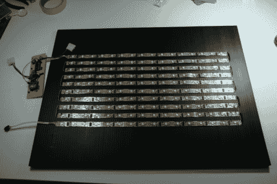

# RGB 条纹的视频显示让它看起来如此简单

> 原文：<https://hackaday.com/2011/11/18/video-display-from-rgb-strips-makes-it-seem-so-easy/>

[杨奇煜]来信分享了他制作的这个 RGB 视频显示器的链接。他有一些非常酷的例程，使它比你想象的更有功能，但首先我们想评论一下构造。他使用了一个 RGB 条，这使得这个看起来非常简单。该条具有沿其长度延伸的数据和电源总线。你可以把它分成更小的部分，然后焊接跳线重新连接总线。这正是他在这里所做的，使它成为组装这种尺寸(16×10 像素)显示器的最快方法。

它由 Netduino 驱动，可轻松寻址负责 led 的 LPD8806 驱动器。它通过 Xbee 从计算机获得输入，这使得从网上获取数据或推送可视化变得容易。休息后的视频展示了一幅[梵高]的自画像。由于 160 像素的分辨率无法做到公正，可视化软件显示了这幅画的放大部分，它不断平移，让你看到整个作品。这是一个神话般的效果。

[https://www.youtube.com/embed/td6ioE2f3tY?version=3&rel=1&showsearch=0&showinfo=1&iv_load_policy=1&fs=1&hl=en-US&autohide=2&wmode=transparent](https://www.youtube.com/embed/td6ioE2f3tY?version=3&rel=1&showsearch=0&showinfo=1&iv_load_policy=1&fs=1&hl=en-US&autohide=2&wmode=transparent)