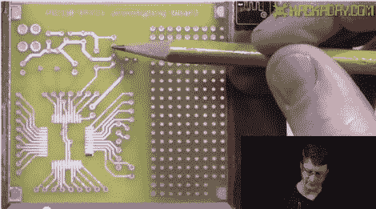

# 视频:焊接 PIC 开发板

> 原文：<https://hackaday.com/2011/09/30/video-soldering-our-pic-development-board/>

对于那些跟随我们的 Eagle CAD 系列的人来说，这是我们组装设计好的电路板的最终回报。在这段视频中，[Jack]解释了电路板上的位置，然后向您展示了如何焊接这些部件。对于那些还没有完全采用表面贴装器件的高级人士来说，他展示了一种焊接处理器的简单方法，这是一种 TQFP-44 器件。这看起来是一项艰巨的任务，但事实并非如此。

如果你想自己做这样的板，你可以在这里找到文件。请注意，虽然这个主板应该没有任何问题，但我们自己还没有测试过。[Jack]将在接下来的几周内制作一些不同主题的视频，但在制作完成后，他会再次拿起这块板。

视频在休息之后。 [https://www.youtube.com/embed/KdvuhTresrQ?version=3&rel=1&showsearch=0&showinfo=1&iv_load_policy=1&fs=1&hl=en-US&autohide=2&wmode=transparent](https://www.youtube.com/embed/KdvuhTresrQ?version=3&rel=1&showsearch=0&showinfo=1&iv_load_policy=1&fs=1&hl=en-US&autohide=2&wmode=transparent)