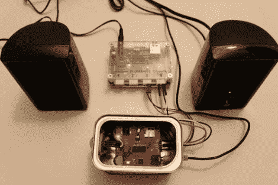

# 剧烈的运动让音乐不断响起

> 原文：<https://hackaday.com/2010/04/16/vigorous-exercise-keeps-the-tunes-coming/>

当你开得更快时，汽车会增加收音机的音量，当你的游戏性提高时，电子游戏会增加音乐的音量(我们正看着你，SSX·特里克)。现在，您可以使用[Polymithic]的[运动反馈 MP3 播放器](http://www.instructables.com/id/Motion-Feedback-MP3-Player/)将该功能添加到您的锻炼中。它使用一个[被动红外传感器](http://en.wikipedia.org/wiki/Passive_infrared_sensor)来检测运动，所以不需要佩戴任何电子设备。但是如果你使用一些蓝牙耳机，你可以把这个系统带到健身房，只是不要运动得太剧烈，以至于把你的耳膜吹破。

[via [被黑的小工具](http://hackedgadgets.com/2010/04/15/motion-feedback-mp3-player/)