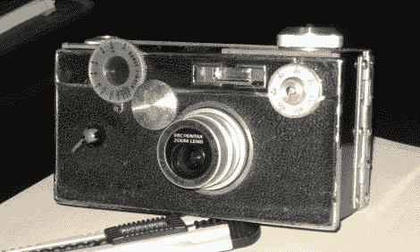

# 老式相机改造完美的陌生人

> 原文：<https://hackaday.com/2011/10/12/vintage-camera-retrofit-perfect-for-trolling-strangers/>

[约翰]喜欢用不寻常的垃圾制作东西，并决定[建造一些东西，唯一的目的就是为了吸引别人。他觉得把一台新的数码相机塞进一台旧的、过时的相机里，看看人们会有什么反应会很有趣。](http://www.instructables.com/id/60-year-old-digital-camera/?ALLSTEPS)

他考虑了几种不同的相机，包括一个笨重的老宝丽来，最终确定了一个更易于管理的阿格斯 C3。相机不够大，无法将他的新数码相机放入其中，所以他用黑色米卡塔制作了一个模拟机身。他将 Argus 的正面和背面连接到他的塑料盒上，然后花了一些时间将他的数码相机安装到里面。在拿出相机进行一些测试之前，他将原来相机的旋钮转移到了新的假身上，增加了真实性。

你可以看到上面的最终结果，我们认为你很难注意到他的相机有什么不对劲，除非你花一些时间仔细看看它。他说，这在很大程度上工作得很好，这绝对是一个对话的开始。人们总是对他使用如此老旧的照相机感到困惑，尤其是当他告诉他们要拍 4000 张照片才能“冲洗”照片时。