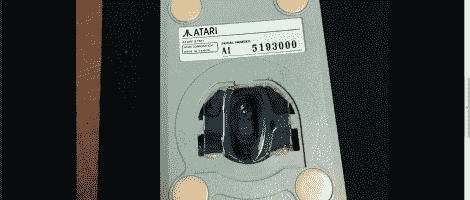
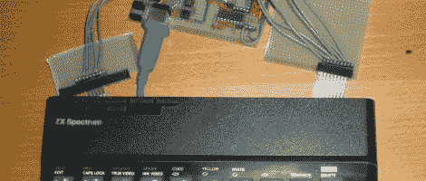
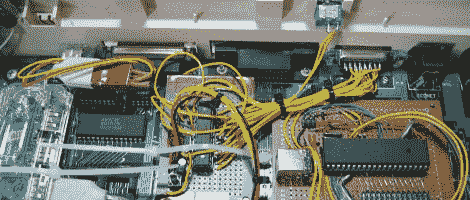

# 老式外设黑客综述

> 原文：<https://hackaday.com/2011/06/08/vintage-peripheral-hacks-roundup/>

几天前，[我们特别推出了一款 Apple ][ USB 键盘 mod](http://hackaday.com/2011/06/06/apple-converted-into-usb-keyboard/) ，几位读者附和着在评论区分享了他们自己的复古改装。我们不知道你们中的许多人自己也做了类似的修改，所以这里有一个你的 Hackaday 读者朋友们整理的快速综述。

 **光学雅达利 STM1 鼠标**

[JJ]有一个 25 岁的 Atari STM1 鼠标，他想知道如何让它和他的新电脑一起工作。他没有通过定制的电路板将旧鼠标与他的计算机连接起来，而是取出了 STM1，并用一种更新的光电鼠标替换了内部部件。他做了一些修整，让新的 PCB 适合，通过现在空的“球孔”瞄准光学传感器。根据[JJ]的说法，它的效果和它看起来一样好。

 **ZX 频谱 USB 键盘转换**

[李]对老式硬件情有独钟，在他的朋友[兰瑟]的帮助下，[将一台旧的辛克莱·ZX 频谱计算机](http://www.benf.org/other/speccyusbkbd/index.html)恢复成一个可以工作的 USB 键盘。更换了损坏的薄膜后，两人绘制了键盘图，以弄清楚矩阵是如何连接的。完成后，他们建造了一个原型 USB 接口板，后来他们用一个合适的 PCB 代替了它。

 **BBC Master 紧凑型 USB 键盘转换**

[MoJo 的]一个朋友有一台 BBC Master Compact 计算机，他想把键盘转换成 USB,以便在某些模拟器上使用。[MoJo]欣然接受了这个项目，剥离了一些旧的主板组件，为他的新电路腾出了空间。他在 ATMega162 周围建立了一个 USB 接口板，甚至让旧的内置扬声器正常工作。从外面看，键盘看起来从未被触摸过——干得好！